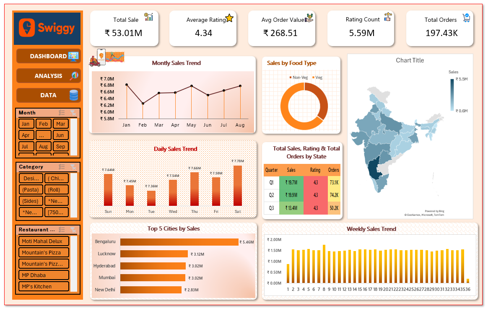
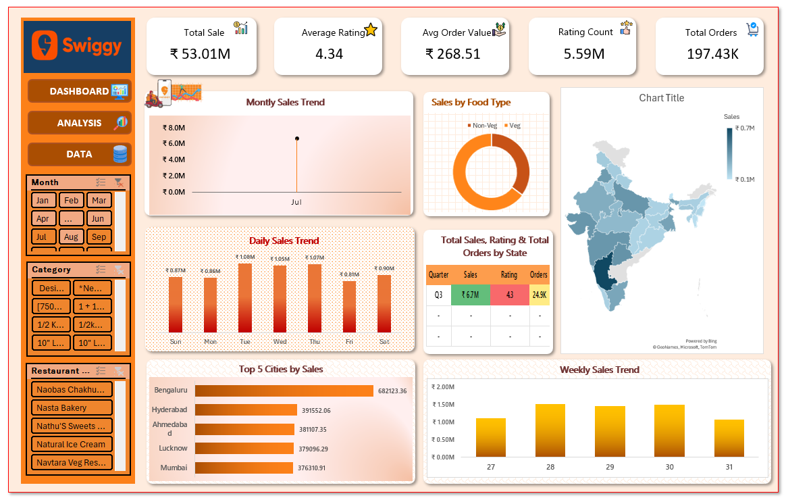
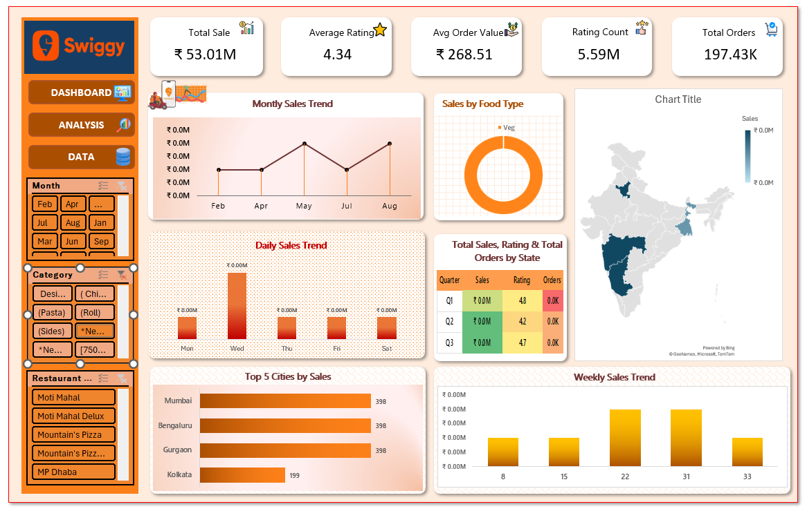
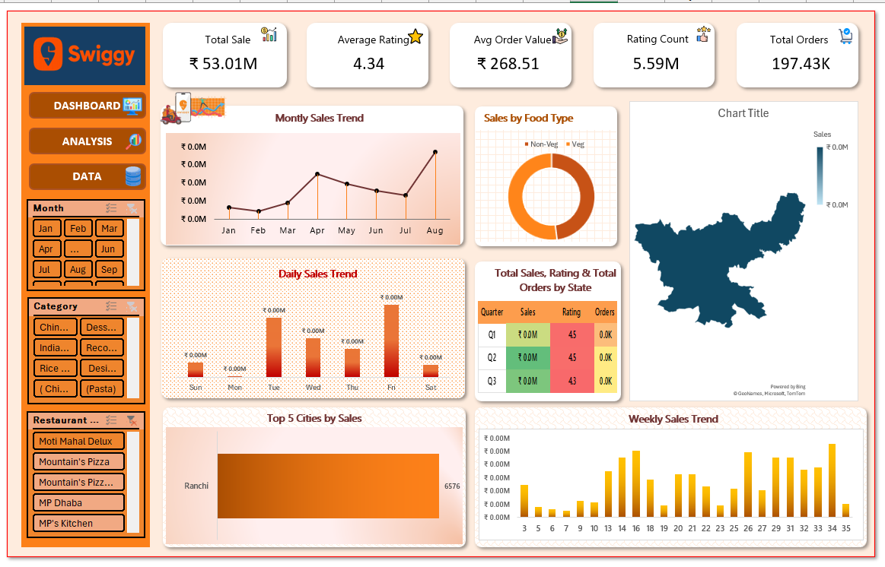

# 🍔 Swiggy Food Delivery Data Analysis Dashboard

## 📊 Project Overview

Hello Everyone,  

Thank you for checking out my Excel Dashboard Project based on **Swiggy Food Delivery Data Analysis**.

This project focuses on transforming raw food delivery data into meaningful business insights using **Microsoft Excel**, interactive dashboards, and visualization techniques.

---

## 🎯 Objective

The main objective of this project is to analyze:
- Sales performance
- Customer behavior
- Order trends
- Food category insights

and convert raw data into actionable business insights through data visualization.

---

## 🔹 Key KPIs Included

- 💰 Total Sales Revenue
- ⭐ Average Customer Rating
- 🛒 Average Order Value
- 📝 Total Ratings Count
- 📦 Total Orders Received

---

## 📈 Dashboard Visualizations

- Monthly Sales Trend Analysis
- Daily Sales Trend Analysis
- Weekly Trend Monitoring
- Veg vs Non-Veg Sales Comparison
- State-wise Sales Distribution
- Quarterly Performance Summary
- Top 5 Cities Analysis

---

## 🛠 Tools & Techniques Used

- Microsoft Excel
- Pivot Tables
- Pivot Charts
- Data Cleaning
- Dashboard Design
- Data Visualization
- Business Analytics

---

## 📂 Project Files

```bash
Swiggy_Dashboard_Project/
│
├── img/
│   ├── dashboard1.png
│   ├── dashboard2.png
│   ├── dashboard3.png
│   ├── dashboard4.png
│   └── dashboard5.png
│
├── Swiggy Dashboard.xlsb
└── README.md
```

---

# 📸 Dashboard Preview

## Main Dashboard


## Sales Trend Analysis


## Category Insights


## State-wise Sales Analysis


## Top Cities Performance


---
## 👨‍💻 Created By

**Pratiksha Patil**

---

## 🙌 Thank You

Thank you for visiting this project.  
I hope you find it insightful and valuable.

If you liked this project, feel free to connect and share your feedback.
